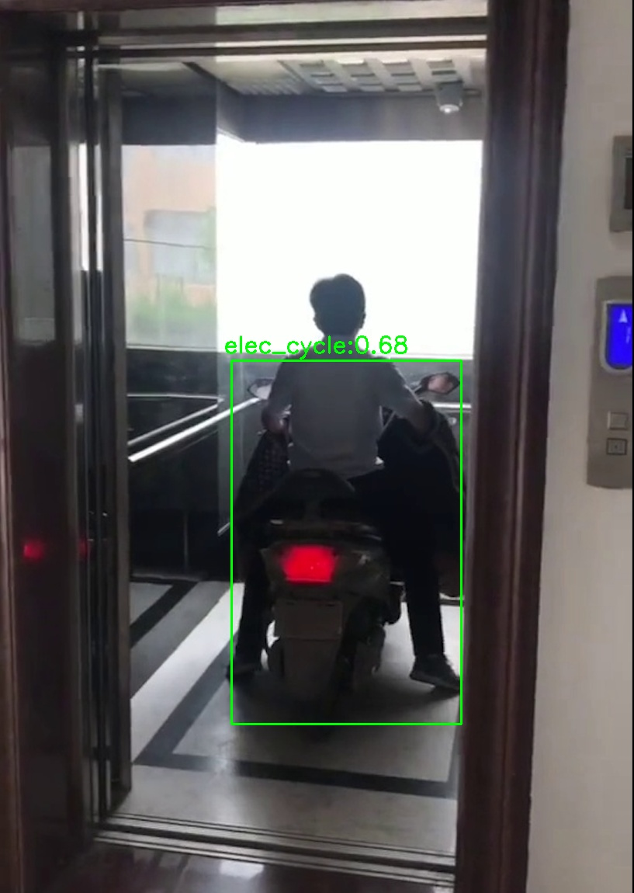

# Megvii Electric Moped Detector
包含电动车检测 ONNX 模型及推理代码

  

[完整视频](https://v.qq.com/x/page/y32460fxgf6.html)

## 准备工作
安装 cuda 10.1 以及 cudnn 7.6.3

## 安装
```
git clone https://github.com/megvii-research/electric_moped_detector.git
cd electric_moped_detector
pip3 install -r requirements.txt
cd electric_moped_detector/utils/lib_nms && bash compile.sh && cd ../../..
```

## 推理
```
python3 scripts/inference.py  --detector ./models/model.onnx --input-img ./demo/input.jpg --model-json ./models/config.json --output-path ./demo/output.jpg

--detector     ：onnx模型
--input-img    ：输入图片地址
--model-json   ：模型的配置文件地址
--output-path  ：检测结果文件地址
```

